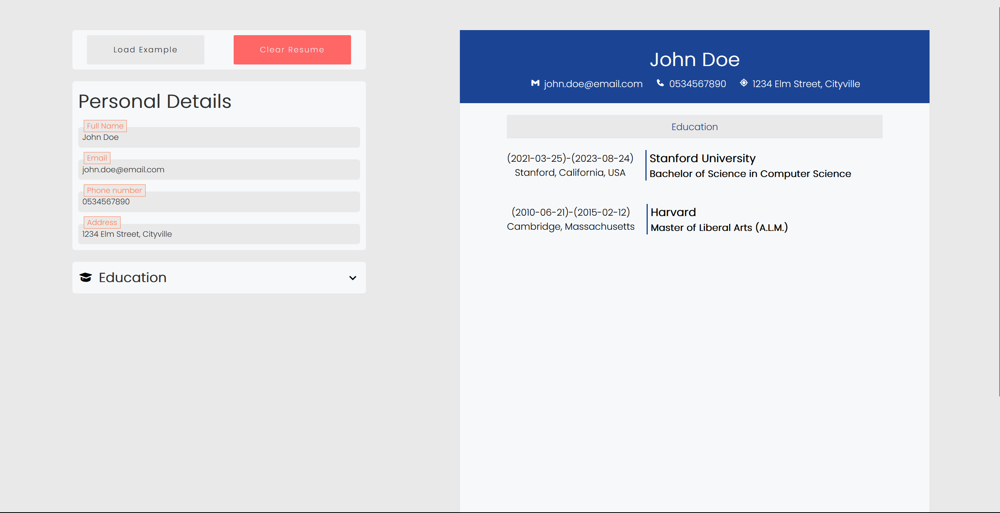

# CV Application

## Description

CV Application is a web-based tool that allows users to create their CV/resume quickly and efficiently. It provides a user-friendly interface to input personal information, educational background, work experience, skills, and more. With CV Application, crafting a professional CV has never been easier.

## Demo

For a live demo of CV Application, visit [here](https://cv-application-zeta.vercel.app/) <!-- Replace "link-to-live-demo" with the URL to your live demo (if available) -->

## Features

- Easily create and customize your CV/resume.
- Intuitive and responsive design for a seamless user experience.
- Sections for personal details, education, work experience, skills, and more.
- Download your CV/resume as a PDF file.
- Add and manage multiple CVs for different purposes.

## How to Use

1. Clone the repository from GitHub:
   git clone `https://github.com/YotamOfri/CV-Application-.git`

2. Navigate to the project
   directory:`cd CV-Application-`

3. Open the `index.html` file in your web browser.

4. Fill in the required details and customize your CV as needed.

5. Once you're satisfied with your CV, you can download it as a PDF file.

## Contributing

Contributions are welcome! If you'd like to add new features, fix bugs, or improve the application, please follow these steps:

1. Fork the repository.

2. Create a new branch: `git checkout -b feature/your-feature-name`

3. Make your changes and commit them: `git commit -m "Add your commit message here"`
4. Push your changes to your forked repository:`git push origin feature/your-feature-name`

5. Open a pull request on the main repository.

## License

This project is licensed under the [MIT License](link-to-license) <!-- Replace "link-to-license" with the URL to your license file (if available) -->

## Contact

For any questions or inquiries, feel free to reach out to me:

- Name: Yotam Ofri
- GitHub: [@YotamOfri](https://github.com/YotamOfri)
